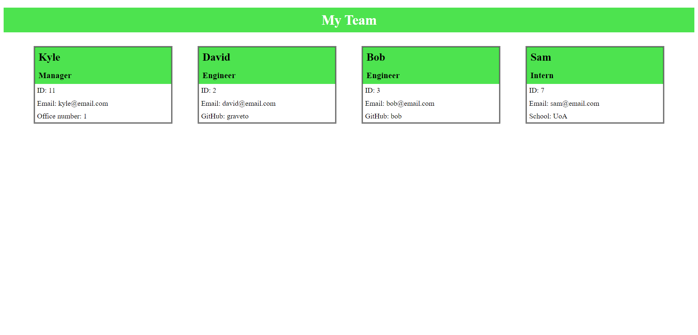

# Team Profile Generator
A Node.js command-line application that takes in information about employees on a team and generates an HTML webpage that displays summaries for each person.

## Table of Contents
---
- [Installation](#installation)
- [Usage](#usage)
- [License](#license)
- [Contributing](#contributing)
- [Tests](#tests)
- [Questions](#questions)

## Installation
---
Clone this repository to a directory. Then install inquirer by running the code:

    npm i

## Usage
---
To invoke the application run the following command:

    node index.js

https://drive.google.com/file/d/1ArxgrrR2CgLY-xNLYKWZXrPw4795pvDm/view

## License
---

## Contributing
---
Please refer to the [Contributor Covenant](https://www.contributor-covenant.org/) before contributing to this project.

## Tests
---
Use the following command to run tests:

    npm run test

## Questions
---
https://github.com/kyleschop/

Please email klparuu@yahoo.com with additional questions. 